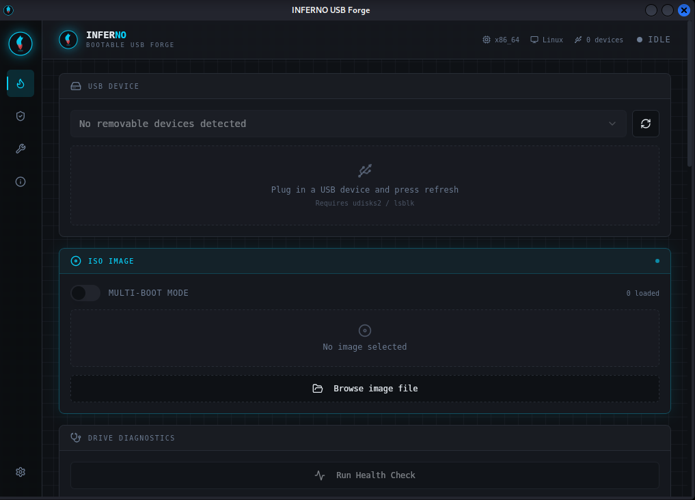
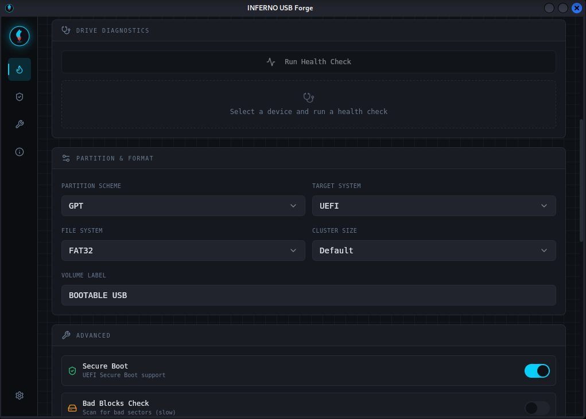
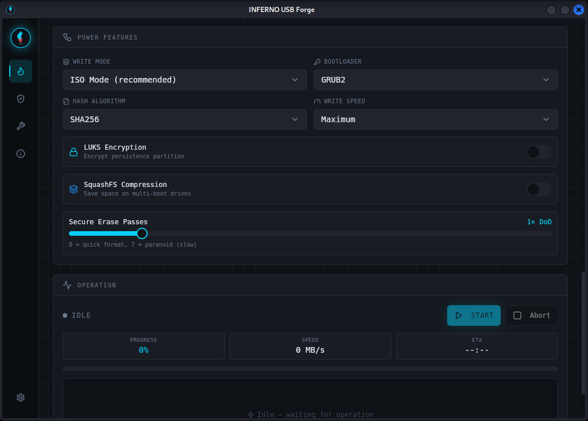
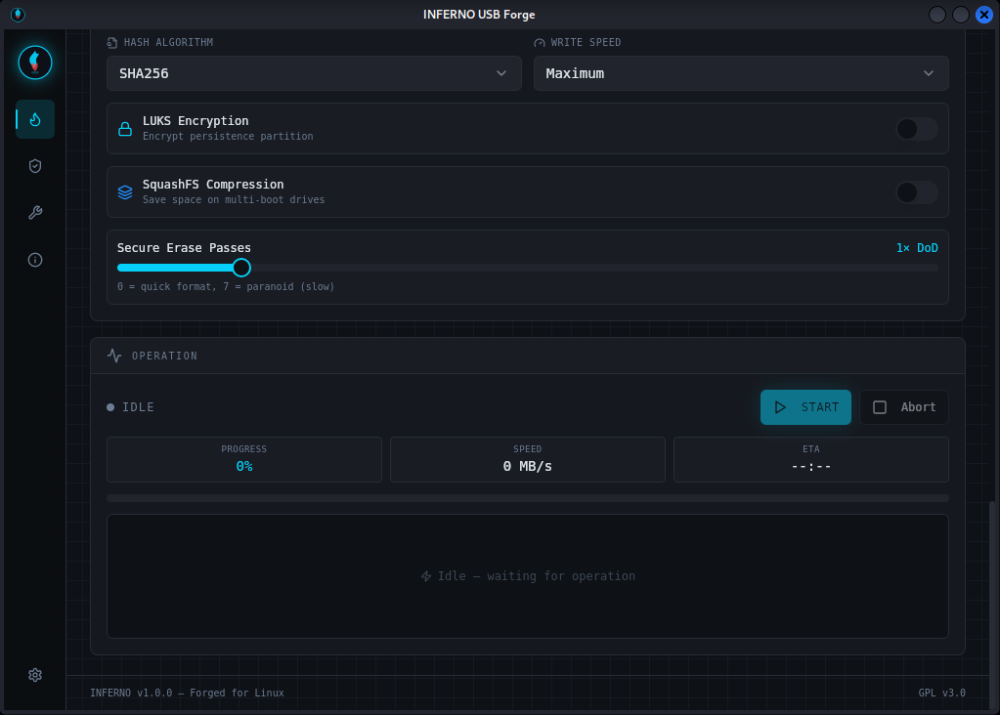
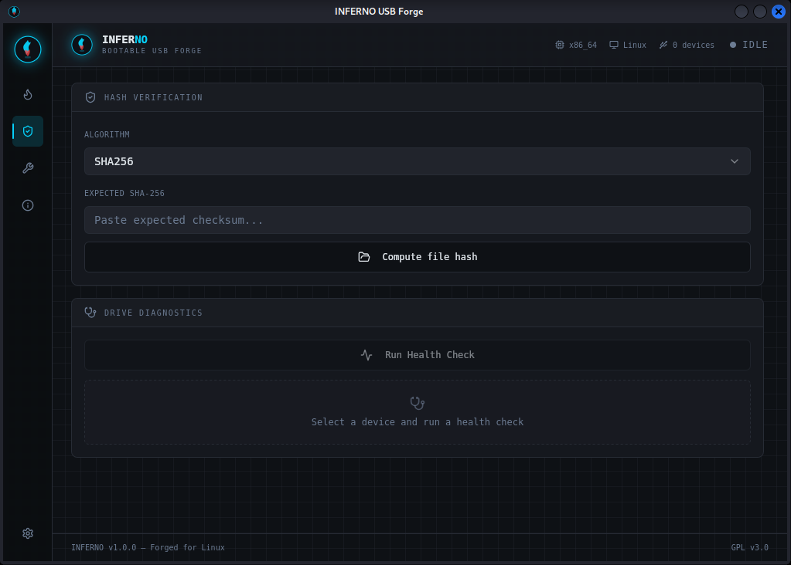
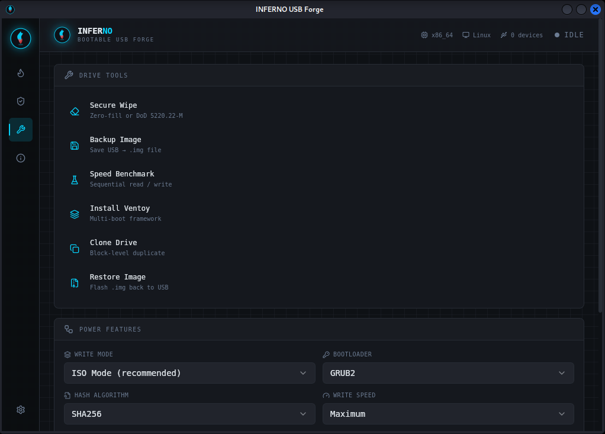
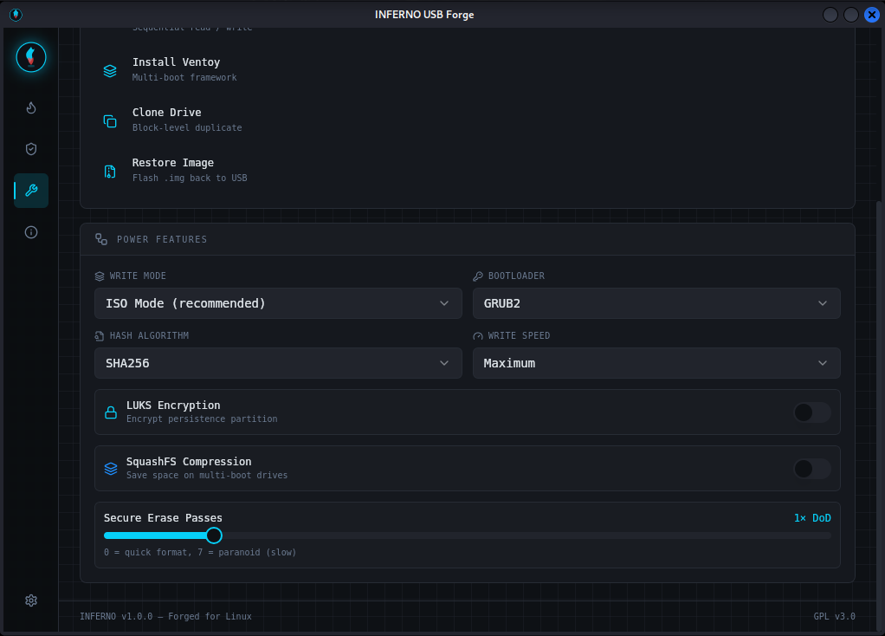
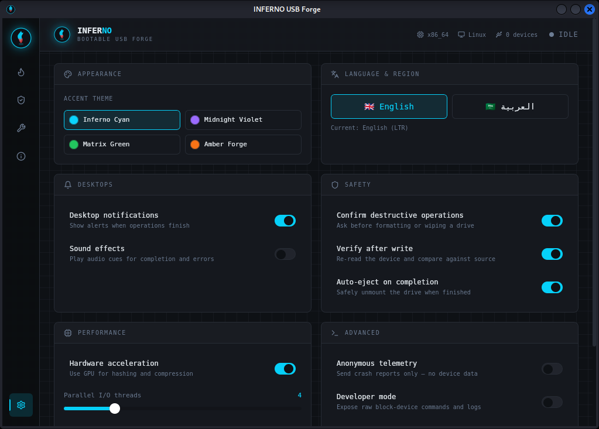

<div align="center">


# INFERNO USB Forge

**أداة Linux الاحترافية لإنشاء USB قابلة للتشغيل**

*Professional Bootable USB Creator for Linux — Native Desktop App*

[](https://kernel.org)
[](https://tauri.app)
[](https://react.dev)
[](https://rustlang.org)
[](https://www.gnu.org/licenses/gpl-3.0)
[]()

---

*Crafted by **[Ahmed Nour](https://ahmednour.vercel.app)***

</div>

---

## 📸 Screenshots

| Forge View | ISO + Drive Selected |
|:---:|:---:|
|  |  |

| Writing in Progress | Verify Tab |
|:---:|:---:|
|  |  |

| Drive Tools | Settings & Themes |
|:---:|:---:|
|  |  |

| About Page | Arabic RTL Mode |
|:---:|:---:|
|  |  |

---

## 🔥 Overview

**INFERNO USB Forge** is a powerful, native Linux desktop application for creating bootable USB drives with professional-grade features. Built with **Tauri v2** (Rust backend + React frontend), it delivers a blazing-fast, lightweight experience without the bloat of Electron.

Unlike basic GUI wrappers around `dd`, INFERNO is a complete USB management suite — from single ISO flashing to multi-boot Ventoy setup, LUKS encryption, S.M.A.R.T. diagnostics, secure erase, drive cloning, hash verification, and real-time benchmarking — all from one sleek, dark-themed interface.

---

## ✨ Features

### 🔥 Forge (Main Write Engine)
- **ISO Flashing** — DD-level raw write with configurable buffer size (default 32 MB)
- **Multi-boot via Ventoy** — Install Ventoy and drop multiple ISOs onto one drive
- **Hybrid mode** — ISO + Ventoy combined for maximum compatibility
- **Real-time progress** — Live write speed, ETA, and log stream from the Rust backend via Tauri events
- **Post-write SHA-256 verification** — Auto-verifies the written data after completion
- **Abort control** — Cancel any running operation safely

### 🗂️ Partition & Boot Options
- **Partition schemes** — MBR, GPT, or Hybrid
- **Boot targets** — BIOS, UEFI, or both (dual-boot compatible)
- **Filesystem** — FAT32, exFAT, NTFS, ext4
- **Cluster size** — Tunable for optimal performance per filesystem
- **Volume label** — Custom drive label support

### ⚙️ Advanced Options
- **Secure Boot** — Sign bootloader for UEFI Secure Boot environments
- **Bad block scan** — Pre-write surface check via `badblocks`
- **Checksum generation** — Auto-generate `.sha256` sidecar after write
- **Persistence partition** — Create a writable LUKS-encrypted persistence layer (live Linux distros)

### ⚡ Power Features
- **Write modes** — ISO Mode, DD Mode, Ventoy, Hybrid
- **Bootloaders** — GRUB2, Syslinux, ISOLinux, rEFInd, systemd-boot
- **Hash algorithms** — MD5, SHA-1, SHA-256, SHA-512, BLAKE3
- **Write speed profiles** — Max, Balanced, Safe
- **LUKS encryption** — Encrypt persistence partition with a passphrase
- **SquashFS compression** — Compress live filesystem layers
- **Secure erase passes** — 0–7× DoD-standard overwrite before writing

### 🩺 Drive Health (S.M.A.R.T.)
- Real-time S.M.A.R.T. diagnostics via `smartctl`
- Shows temperature, power-on hours, reallocated sectors, pending sectors, uncorrectable errors
- Color-coded status: Healthy / Warning / Fail
- Works on HDD, SSD, and USB flash drives (where supported)

### 🔑 Hash Verifier
- Compute cryptographic hash of any file — ISO images, firmware, archives
- Algorithms: SHA-256, SHA-512, SHA-1, MD5, BLAKE3
- Paste an expected hash and get an instant match/mismatch verdict
- Native file dialog via Tauri, with Web Crypto API fallback for browser mode

### 🛠️ Drive Tools

| Tool | Description |
|------|-------------|
| **Secure Wipe** | DoD-grade overwrite using `dd` |
| **Backup to Image** | Save drive as `.img` or `.img.gz` |
| **Benchmark** | Measure read/write speeds in MB/s |
| **Ventoy Install** | Install Ventoy with Secure Boot support |
| **Clone Drive** | Byte-for-byte copy to another device |
| **Restore Image** | Flash a `.img` backup back to a drive |

### 🎨 Themes & Customization

Four built-in color themes (real-time CSS custom property switching):

| Theme | Color | Hex |
|-------|-------|-----|
| Inferno Cyan | 🔵 | `#0ad4ff` |
| Midnight Violet | 🟣 | `#9b6bff` |
| Matrix Green | 🟢 | `#22c55e` |
| Amber Forge | 🟠 | `#f97316` |

### 🌐 Internationalization
- **Full Arabic (RTL) support** — Complete UI direction flip via `dir="rtl"`
- **English** — Default language
- Cairo font for Arabic, monospace for English
- Language toggle persisted to `localStorage`

### ⚙️ Settings Panel
All settings persist via `localStorage`:
- Theme selection with live preview
- Language toggle (English / Arabic)
- Notifications & sound toggles
- Safety guards: confirm before destructive ops, auto-eject, verify-after-write
- Performance: hardware acceleration, parallel I/O threads (1–8), buffer size (1–128 MB)
- Developer mode & telemetry opt-out

---

## 🏗️ Architecture

```
inferno-usb-forge/
├── src/                           # React frontend (TypeScript)
│   ├── pages/
│   │   └── Index.tsx              # Root layout — sidebar + view router
│   ├── components/
│   │   ├── USBDriveSelector.tsx   # lsblk-powered drive picker
│   │   ├── ISOSelector.tsx        # Multi-ISO library with file dialog
│   │   ├── PartitionOptions.tsx   # MBR/GPT/BIOS/UEFI selectors
│   │   ├── AdvancedOptions.tsx    # Secure Boot, bad blocks, persistence
│   │   ├── PowerFeatures.tsx      # Write mode, bootloader, LUKS, SquashFS
│   │   ├── ProgressPanel.tsx      # Real-time write progress + log stream
│   │   ├── DriveHealth.tsx        # S.M.A.R.T. diagnostics display
│   │   ├── HashVerifier.tsx       # File hash compute + verify
│   │   ├── DriveTools.tsx         # Wipe, backup, benchmark, Ventoy, clone
│   │   ├── SettingsPanel.tsx      # Theme, i18n, safety & perf settings
│   │   ├── SystemDeps.tsx         # Runtime dependency checker
│   │   ├── InfernoLogo.tsx        # Animated SVG flame logo
│   │   ├── SectionPanel.tsx       # Reusable card wrapper component
│   │   └── StatusIndicator.tsx    # Idle / Ready / Busy / Error indicator
│   ├── lib/
│   │   ├── api.ts                 # Tauri IPC bridge — all invoke() calls
│   │   └── utils.ts               # cn() Tailwind class merger
│   ├── i18n/
│   │   ├── translations.ts        # All EN + AR strings (~150 keys)
│   │   └── index.tsx              # useI18n() hook + context
│   └── index.css                  # Tailwind base + CSS custom properties
│
├── src-tauri/                     # Rust backend (Tauri v2)
│   ├── src/
│   │   └── main.rs                # All Tauri commands (IPC handlers)
│   ├── tauri.conf.json            # App config, window, bundle targets
│   └── Cargo.toml                 # Rust dependencies
│
├── packaging/
│   ├── inferno-usb-forge.desktop  # .desktop entry for app launchers
│   └── 99-inferno-usb.rules       # udev rules for USB device access
│
├── install-deps.sh                # One-shot system dependency installer
├── build-packages.sh              # Build .deb + AppImage
└── screenshots/                   # UI screenshots
```

### IPC Data Flow

```
React (TypeScript)              Tauri IPC               Rust
────────────────────────────    ──────────────────────  ───────────────────────
api.listUsbDrives()         →   invoke("list_usb_drives")   → lsblk JSON parse
api.startWriteIso(...)      →   invoke("start_write_iso")   → dd + event stream
api.getSmartHealth(...)     →   invoke("get_smart_health")  → smartctl parse
api.computeFileHash(...)    →   invoke("compute_file_hash") → sha256sum / b3sum
api.secureWipeDevice(...)   →   invoke("secure_wipe_device")→ dd if=/dev/zero
api.benchmarkDrive(...)     →   invoke("benchmark_drive")   → dd read/write test
api.installVentoy(...)      →   invoke("install_ventoy")    → ventoy CLI wrap
                        ←   emit("write-progress", payload) ← real-time stream
```

Progress events use Tauri's `app.emit()` from a spawned async Rust task. React subscribes via `listenEvent()` which wraps `listen()` with auto-cleanup on component unmount.

---

## 🚀 Getting Started

### Prerequisites

| Tool | Minimum Version | Purpose |
|------|----------------|---------|
| Rust | stable | Tauri backend compilation |
| Node.js | ≥ 18 | Frontend build toolchain |
| npm | ≥ 9 | Package management |
| Linux x86_64 | any | **Only supported platform** |

### 1. Install system dependencies

```bash
chmod +x install-deps.sh
./install-deps.sh
```

Supported distros and their package managers:
- **Debian / Ubuntu / Mint / Pop!_OS** → `apt`
- **Fedora / RHEL / CentOS** → `dnf`
- **Arch Linux / Manjaro** → `pacman`
- **openSUSE** → `zypper`

Installs: Tauri build libs (WebKit, GTK3, librsvg, OpenSSL, pkg-config), runtime tools (udisks2, smartmontools, util-linux, coreutils), Rust via rustup, Node.js via NodeSource.

### 2. Install JavaScript dependencies

```bash
npm install --legacy-peer-deps
```

### 3. Run in development mode

```bash
npm run tauri:dev
```

Starts Vite dev server on `:5173` and opens the native window with hot module replacement.

### 4. Build release packages

```bash
./build-packages.sh           # .deb + AppImage (default)
./build-packages.sh deb       # .deb only
./build-packages.sh appimage  # AppImage only
```

Output: `./dist-packages/`

---

## 📦 Installation

### .deb (Debian / Ubuntu / Mint)

```bash
sudo dpkg -i dist-packages/inferno-usb-forge_1.0.0_amd64.deb
sudo apt-get install -f   # fix any missing deps
```

### AppImage (universal)

```bash
chmod +x dist-packages/inferno-usb-forge_1.0.0_x86_64.AppImage
./dist-packages/inferno-usb-forge_1.0.0_x86_64.AppImage
```

### USB device access without sudo

```bash
sudo cp packaging/99-inferno-usb.rules /etc/udev/rules.d/
sudo udevadm control --reload-rules && sudo udevadm trigger
# Log out and back in for group changes to apply
```

---

## 🔧 System Requirements

| Dependency | Purpose | Required? |
|-----------|---------|-----------|
| `lsblk` (util-linux) | USB device enumeration | **Required** |
| `dd` (coreutils) | Write ISO to device | **Required** |
| `udisksctl` (udisks2) | Safe mount/unmount | Recommended |
| `smartctl` (smartmontools) | S.M.A.R.T. diagnostics | Optional |
| `b3sum` | BLAKE3 hashing | Optional |
| `ventoy` | Multi-boot install | Optional |
| `badblocks` (e2fsprogs) | Bad block scanning | Optional |
| `shred` (coreutils) | Secure erase | Optional |

The **SystemDeps** panel inside the app shows real-time status of all tools.

---

## ⚠️ Safety Features

- **Removable check** — Only devices marked `REMOVABLE=1` by the kernel appear in the list
- **Destructive confirmation** — All write, wipe, and clone operations require explicit confirmation
- **Auto-verify** — Post-write SHA-256 verification enabled by default
- **Auto-eject** — Drive is safely unmounted before writing begins
- **No root required** — udev rules grant block device access without running as root

---

## 🛠️ Technical Challenges

### 1. Tauri v2 Plugin API Overhaul
Tauri v2 broke compatibility with v1 across the board. The monolithic `@tauri-apps/api` split into separate plugins — `plugin-shell`, `plugin-dialog`, `plugin-fs`, `plugin-notification` — each requiring its own Cargo dependency and explicit `init()` in `main.rs`. The invoke syntax also changed: `window.__TAURI__.invoke()` became `@tauri-apps/api/core`. The IPC bridge in `src/lib/api.ts` was built with a graceful fallback for browser dev mode (no Tauri context available), throwing a descriptive error instead of crashing.

### 2. Real-time Write Progress Streaming
Streaming write progress from a long-running `dd` process to React requires Tauri's event system, not standard IPC (which is strictly request-response). The architecture: spawn the write task as a Tokio async task in Rust, call `app.emit("write-progress", payload)` at each progress tick, and subscribe in React via `listenEvent()`. The unlisten function returned by `listen()` must be stored in a `useRef` and called on component unmount or operation abort — failing to do this leaks the event listener and causes stale state updates on ghost components.

### 3. USB Device Detection via lsblk JSON
`lsblk --json` returns a nested tree with `children` arrays. Parsing in Rust requires recursive flattening, filtering by `TRAN=usb` and `RM=1` (removable flag), and normalizing empty `MOUNTPOINTS` arrays (`[""]` vs `[]`) to correctly report mounted status. Edge cases include multi-partition drives (where the parent block device has children that are the actual partitions) and NVMe drives that must be excluded despite sometimes appearing in USB enclosures.

### 4. Full RTL Arabic Layout
True RTL support in Tailwind requires more than `dir="rtl"` on the root element. Directional utilities (`left-0`/`right-0`, border sides, absolute positioning) flip automatically with CSS logical properties — but only if `dir` is set on the correct ancestor. The sidebar's active-view indicator (a 2px vertical bar) is conditionally placed `left-0` or `right-0` based on `lang` prop threaded from the `useI18n()` hook. All 150+ translation keys were written in parallel for English and Arabic, including proper Arabic UI terminology for technical terms like "partition scheme" (مخطط التقسيم) and "bootloader" (محمل التشغيل).

### 5. WebKitGTK Rendering Quirks on Linux
Tauri on Linux renders via WebKitGTK, which differs from Chrome in several areas. `backdrop-filter: blur()` requires `--webkit-backdrop-filter` and hardware acceleration to be enabled. `position: sticky` inside `overflow: auto` flex children requires careful container nesting — the sticky header and sidebar both needed their overflow context adjusted. The scan-line animation on the progress bar (`animate-scan-line`) also required a custom CSS keyframe rather than a Tailwind animation class because WebKitGTK's animation compositing path differs from Blink's.

### 6. udev Rules for Non-root Block Device Access
Writing to `/dev/sdX` normally requires root. The clean production solution is a udev rule that grants the `disk` group write access to USB removable block devices. The rule in `packaging/99-inferno-usb.rules` matches `SUBSYSTEM=="block"` + `ATTR{removable}=="1"` and sets `GROUP="disk"` with `MODE="0660"`. This avoids running the Tauri app as root (which would break GTK theming and sandboxing) while still allowing direct device writes.

### 7. AppImage Media Framework Bundling
The AppImage target requires `bundleMediaFramework: true` in `tauri.conf.json`. Without it, the AppImage fails on minimal distros (Arch, Alpine) because WebKitGTK's media pipeline depends on GStreamer plugins that aren't present on all systems. The bundled media framework adds ~15 MB to the AppImage but guarantees it runs on any Linux x86_64 system regardless of installed GStreamer packages.

---

## 🧩 Tech Stack

| Layer | Technology | Version |
|-------|-----------|---------|
| Desktop framework | [Tauri](https://tauri.app) | v2 |
| Backend language | Rust | stable |
| Frontend framework | React | 18 |
| Language | TypeScript | 5.x |
| Build tool | Vite + SWC | 5.x |
| UI components | shadcn/ui + Radix UI | latest |
| Styling | Tailwind CSS | v3 |
| Animations | Framer Motion | 12 |
| Icons | Lucide React | 0.462 |
| Forms | React Hook Form + Zod | latest |
| Package targets | `.deb`, `.AppImage` | — |

---

## 📄 License

**GNU General Public License v3.0**

This program is free software: you can redistribute it and/or modify it under the terms of the GNU General Public License as published by the Free Software Foundation, either version 3 of the License, or (at your option) any later version.

See https://www.gnu.org/licenses/gpl-3.0 for the full text.

---

<div align="center">

**INFERNO USB Forge** — Forged for Linux 🔥

Made with Rust + React by **[Ahmed Nour](https://ahmednour.vercel.app)**

</div>
